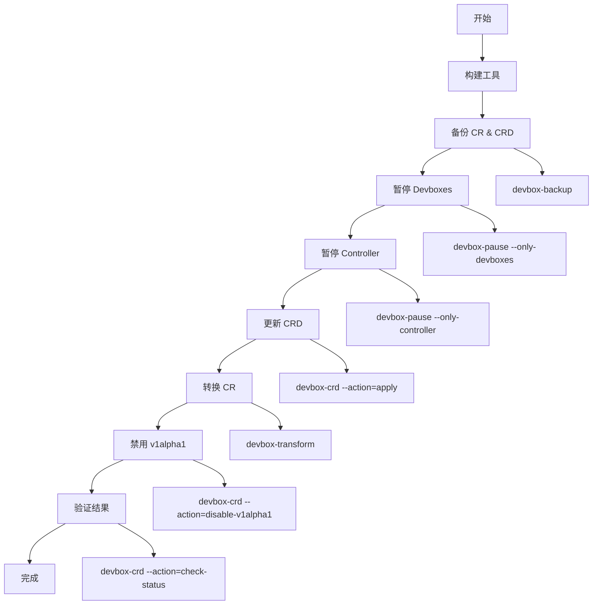

# Devbox升级工具概览

## 工具架构

原来的单一`cmd/upgrade`工具已被拆分为5个独立的工具，每个工具负责升级流程中的特定步骤：

```
cmd/
├── devbox-backup/     # 备份CR和CRD
├── devbox-pause/      # 暂停devbox和controller
├── devbox-transform/  # 转换CR版本
├── devbox-crd/        # 管理CRD
└── devbox-restore/    # 恢复devbox状态
```

## 工具功能对比

| 工具 | 主要功能 | 输入 | 输出 |
|------|----------|------|------|
| `devbox-backup` | 备份所有CR和CRD | Kubernetes集群 | YAML备份文件 |
| `devbox-pause` | 暂停devbox和controller | Kubernetes集群 | 状态备份JSON + YAML |
| `devbox-crd` | 应用/更新/管理CRD | CRD YAML文件 | 更新的CRD |
| `devbox-transform` | 转换CR存储版本 | v1alpha1 CR | v1alpha2 CR |
| `devbox-restore` | 恢复devbox状态 | 状态备份JSON | 恢复的devbox |

## 升级流程



## 优势

### 1. 模块化设计
- 每个工具职责单一，易于理解和维护
- 可以独立测试和调试
- 支持灵活的组合使用

### 2. 更好的控制
- 可以在任何步骤暂停和检查
- 支持分步执行和验证
- 可以跳过不需要的步骤

### 3. 故障恢复
- 独立的恢复工具
- 详细的备份和状态记录
- 支持部分回滚

### 4. 生产就绪
- 支持dry-run模式
- 批量处理大量资源
- 详细的日志和进度报告

## 使用方式

### 1. 自动化升级（推荐新手）
```bash
./scripts/upgrade-v1-to-v2.sh
```

### 2. 手动升级（推荐生产环境）
```bash
make build-upgrade-tools
./bin/devbox-backup --backup-dir=./backup
./bin/devbox-pause --backup-dir=./backup
./bin/devbox-crd --action=apply --crd-dir=./scripts/manifests
./bin/devbox-transform
./bin/devbox-crd --action=disable-v1alpha1
```

### 3. 自定义升级
根据具体需求选择和组合工具

## 配置选项

每个工具都支持丰富的配置选项：

- `--dry-run`: 预览模式
- `--namespace`: 限制命名空间
- `--backup-dir`: 指定备份目录
- 各种工具特定的选项

## 监控和日志

- 结构化日志输出
- 进度报告
- 错误详细信息
- 操作可追踪性

## 扩展性

新的工具架构易于扩展：

- 添加新的升级步骤
- 支持其他版本转换
- 集成外部工具
- 自定义验证逻辑

## 文档

- `UPGRADE.md`: 详细升级指南
- `examples/upgrade-examples.md`: 使用示例
- 各工具的`--help`输出

## 构建和部署

```bash
# 构建所有工具
make build-upgrade-tools

# 构建单个工具
make build-backup
make build-pause
make build-transform
make build-crd
make build-restore

# 查看可用目标
make help
```

## 最佳实践

1. **总是先dry-run**: 在生产环境中执行前先预览
2. **分步执行**: 在关键环境中逐步执行并验证
3. **保留备份**: 升级后保留备份文件
4. **监控过程**: 在升级过程中监控资源状态
5. **测试恢复**: 在测试环境中验证恢复流程

这种模块化的设计使得Devbox升级过程更加可控、安全和可靠。
